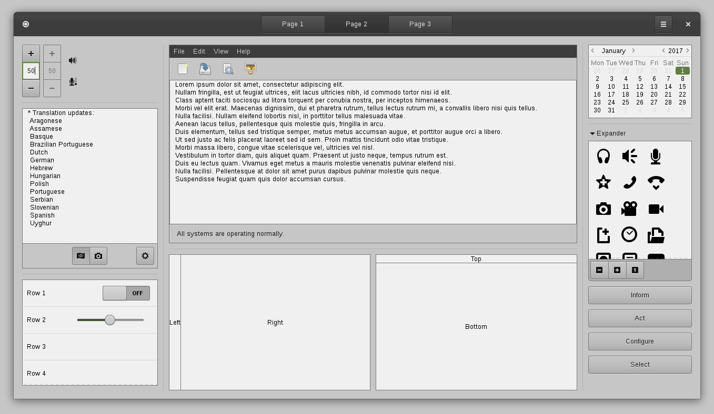

Adwaita Dark Green
==================

About
-----

Adwaita Dark Green is based on Adwaita but with a darker colour set (inspired by [Mediterranean Night Dark](http://gnome-look.org/content/show.php/MediterraneanNight+Series?content=156782)) and dark menu bars.

I find Adwaita too bright, and the Mediterranean series didn't keep up with GTK3's progress, so I made my own version. I used Adwaita as a base as it made integrating changes easier.

The Theme
---------

Adwaita Dark Green includes GTK2, GTK3 (3.18) and Metacity themes.

The following screenshots were taken at [revision ecae148f2522](https://dev.ibboard.co.uk/repos/other/Adwaita-Dark-Green/rev/ecae148f2522)

Copyright/License
-----------------

