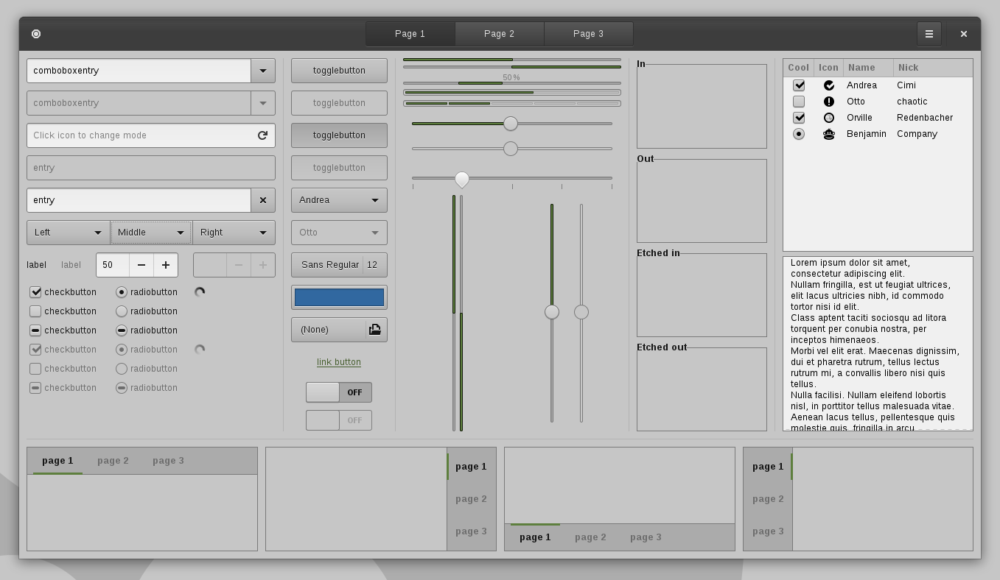

Adwaita Dark Green
==================

About
-----

Adwaita Dark Green is based on Adwaita but with a darker colour set (inspired by [Mediterranean Night Dark](http://gnome-look.org/content/show.php/MediterraneanNight+Series?content=156782)) and dark menu bars.

I find Adwaita too bright, and the Mediterranean series didn't keep up with GTK3's progress, so I made my own version. I used Adwaita as a base as it made integrating changes to GTK's internal changes easier.

The Theme
---------

Adwaita Dark Green includes GTK2, GTK3 (3.16, 3.18 and 3.20/3.22) and Metacity themes.

The following screenshots were taken at [revision ecae148f2522](https://dev.ibboard.co.uk/repos/other/Adwaita-Dark-Green/rev/ecae148f2522)

Chaning the theme
-----------------

If you want to change any of the colours in the theme, edit the colour variable in the first ~100 lines of the appropriate gtk.scss and run
./parse-sass.sh.

Note: GTK 3 has introduced a built-in versioning system to help themes deal with the various internal widget changes between GTK versions. This means that GTK will look for the latest versioned directory that is less than or equal to the version number. When using Adwaita Dark Green then GTK 3 ≤ 3.16 will use the gtk-3.0 directory, GTK 3.18 will use the gtk-3.18 directory and GTK 3 ≥ 3.20 will use the gtk-3.20 directory.

Copyright/License
-----------------

This code is based on [Adwaita by the Gnome/GTK team](https://github.com/GNOME/gtk/tree/master/gtk/theme/Adwaita) and modified by [IBBoard](https://ibboard.co.uk/). It is released under the LGPL v2 license, in accordance with the license on the GTK source code.

This theme is version controlled [on dev.ibboard.co.uk](https://dev.ibboard.co.uk/repos/other/Adwaita-Dark-Green/).